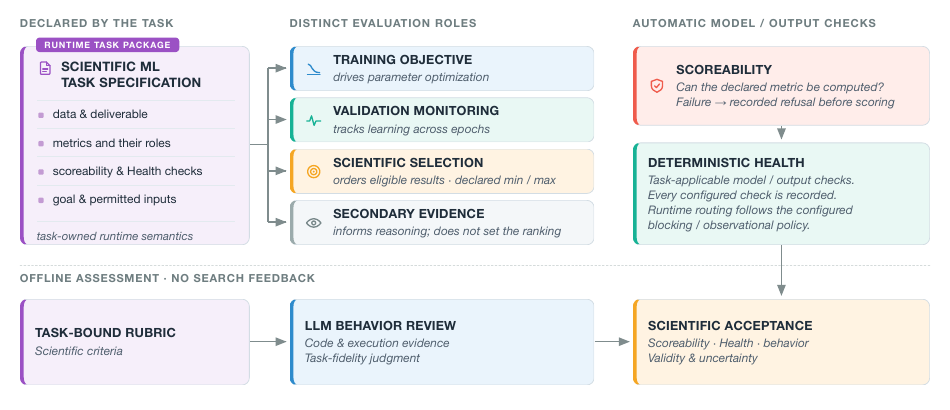

# SIDERIUS

**S**cientific **I**nquiry, **D**esign, **E**xploration, and **R**easoning
**I**ntegrated **U**sing multi-agent **S**ystems

SIDERIUS is a task-generic framework for supervised scientific machine
learning. An LLM can interpret results, propose a model, write model code, and
learn from previous attempts. The framework keeps the parts that must remain
reproducible and comparable under deterministic control: data access, training,
inference, scoring, validity checks, resource limits, and provenance.

The task owns the scientific meaning. The caller owns the workflow composition
and run settings. SIDERIUS supplies the typed interfaces and execution core
that connect them.

## Try a scientific task with siderius-exp

This repository provides the framework. Its companion,
[`siderius-exp`](https://github.com/yuema137/siderius-exp), provides scientific
task packages, experiment configurations, launch scripts, and tutorials.
**Start with the [tutorial guide](https://github.com/yuema137/siderius-exp/blob/main/tutorials/README.md)**
to learn the full path from editing a task to plotting score versus iteration.

The guide offers four notebook demos: **TESS** (stellar rotation), **TIDMAD**
(waveform denoising, one band), **Project8** (electron energy from time and
frequency inputs), and **LIGO** (chirp mass from two detector channels).
Each quick demo runs three research iterations. These are workflow demos,
not reproductions of the paper's artifacts or scores.

Follow the [installation and setup guide](https://github.com/yuema137/siderius-exp/blob/main/tutorials/paper/README.md)
for compatible repository revisions, data, NVIDIA GPU requirements, and API
keys. Work in your own external project directory: the copied notebook explains
and saves your task package and experiment settings, then invokes a saved
script to launch the run. Configurations, scripts, results, and plots stay in
that project; keep credentials outside both source repositories. The notebooks
show how to inspect the saved files and adjust iterations, data fractions,
splits, and time/VRAM budgets before running again. Real runs use GPU resources
and incur API charges.

## How the pieces fit together


**Figure 1 — Infrastructure.** A human scientist, a fixed workflow, or an LLM
orchestrator can call the same scientific capabilities through typed contracts.
The caller chooses the calls, assembles their inputs, and owns control and
history. Each capability owns its reasoning and tools, including executable
Data Analysis.



**Figure 2 — Evaluation.** The task package separates training objectives,
validation monitoring, scientific ranking, and supporting evidence.
Scoreability checks whether the declared metric can be computed; Health
records applicable model/output checks and follows their configured blocking
or observational policy. Offline behavioral review adds evidence for scientific
acceptance without feeding its judgments back into search.

These figures are reproduced from the current SIDERIUS paper build. Their
source and checksums are recorded in
[`docs/assets/paper/README.md`](docs/assets/paper/README.md).

## Quickstart

To check a framework installation without credentials, GPU work or external
data, use the [synthetic Quickstart](examples/quickstart/README.md). It shows
how one small task supplies data access, a model contract and an accuracy metric.

```bash
git clone https://github.com/yuema137/SIDERIUS.git
cd SIDERIUS
uv sync --group dev --frozen
.venv/bin/python -m pytest \
  tests/unit/examples/test_quickstart_pack.py::test_composition_authority_resolves_from_this_checkout \
  tests/unit/examples/test_quickstart_pack.py::test_shipped_manifest_composes_with_the_declared_values -q
```

A real run needs a task package, external data, model/provider routing and a
workspace for results. Preview the chosen launch command before execution;
the chain's `--dry-run` prints child commands but does not prove that a task,
provider account or training attempt will succeed. The
[getting-started guide](docs/getting-started/README.md) leads to the exact setup
and first-run references.

## What you choose

| Choice | What it controls |
| --- | --- |
| Task package | Data meaning, model input/output, objective, metrics and validity checks |
| Workflow | Which research steps run and what evidence passes between them |
| Experiment settings | Provider/model routing, data scope, iterations, Trial/Formal rounds and resource budgets |
| Workspace | Where the run records its identity, generated models and results |

For example, changing the metric changes the task's scientific meaning.
Giving the same task more search time changes the experiment. Keep both choices
explicit so recorded results can be interpreted and compared. Use a fresh
workspace for an intentional new identity; resuming preserves the previous
run's recorded inputs.

## Find the right part

| Need | Start here |
| --- | --- |
| Learn, configure or operate SIDERIUS | [Documentation](docs/README.md) |
| Try framework contracts on synthetic data | [Examples](examples/README.md) |
| Find a research capability or execution owner | [Source map](src/README.md) |
| Choose policy or provider routing | [Configuration](configs/README.md) |
| Find launch and inspection commands | [Scripts](scripts/README.md) |
| Contribute a change | [Contribution reference](CONTRIBUTING.md), [tests](tests/README.md) |

Repository standards are owned by [CLAUDE.md](CLAUDE.md). Scientific packages,
campaigns and historical paper evidence are owned by
[siderius-exp](https://github.com/yuema137/siderius-exp), which pins its compatible
framework revision independently of this repository's latest development head.

## Availability and license

SIDERIUS is currently shared in a closed beta with invited collaborators. It is
not licensed for redistribution or reuse outside that collaboration; all rights
are reserved until a public license is chosen.
