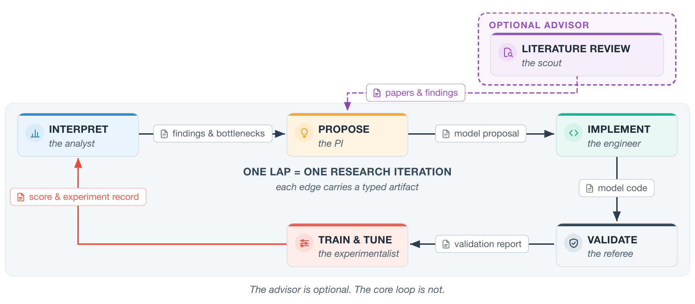

# SIDERIUS

**S**cientific **I**nquiry, **D**esign, **E**xploration, and **R**easoning
**I**ntegrated **U**sing multi-agent **S**ystems

A closed-loop research framework for supervised scientific machine learning.
SIDERIUS combines LLM agents that interpret evidence, propose and implement
models, and reflect on results with deterministic infrastructure that owns
training, inference, scoring, validity checks, and provenance. Agents provide
validated plans; they do not redefine execution rules or task-declared science.

## The reference workflow

[](docs/assets/paper/fig_loop.pdf)

*The shipped reference workflow: interpret → propose → implement → validate →
train and tune, with optional literature review. This original Paper figure is
reused unchanged; its source and conversion record are in
[`docs/assets/paper/README.md`](docs/assets/paper/README.md).*

One iteration follows a fixed, deterministic path over six typed nodes. Tuning
contains training, inference, scoring, and round-level Health checks; its
records provide evidence for the next iteration. Nodes may also be called by a
caller-owned workflow when complete validated inputs and task context are
provided. See the [node contracts](docs/agent-reference/index.md#nodes) and
[custom workflow boundary](docs/guides/custom-workflow.md).

## Start without provider credentials or scientific data

You need Git access to clone this repository, plus [uv](https://docs.astral.sh/uv/):

```bash
git clone git@github.com:Galileo-Sandbox/SIDERIUS.git
cd SIDERIUS
uv sync --group dev --frozen
```

Use this checkout's `.venv/bin/python`; do not borrow another checkout's
environment or use `PYTHONPATH` to source it. The [installation guide](docs/getting-started/installation.md)
has prerequisites.

Two existing checks verify checkout origin and the shipped Quickstart manifest
without calling a provider or running training:

```bash
.venv/bin/python -m pytest \
  tests/unit/examples/test_quickstart_pack.py::test_composition_authority_resolves_from_this_checkout \
  tests/unit/examples/test_quickstart_pack.py::test_shipped_manifest_composes_with_the_declared_values -q
```

Then open the [Quickstart walkthrough](examples/quickstart/README.md). It uses
generated synthetic data in a caller-owned workspace and runs the CPU path; a
real agent-loop call still requires provider credentials.

The shipped examples are framework specifications, not scientific benchmarks:

| Example | What it demonstrates |
| --- | --- |
| [Quickstart](examples/quickstart/README.md) | Synthetic classification, task composition, scopes, and deliverables |
| [Synthetic masked regression](examples/synthetic_masked_regression/README.md) | Validity masks, a task-owned objective, lower-is-better scoring, and Health |

## Inspect a chain command

After preparing Quickstart data, use a fresh run workspace:

```bash
bash scripts/launch/run_chain.sh \
  --mode lilab \
  --workspace /path/to/new-run \
  --run_name first_run_v1 \
  --task_composition configs/task_composition/quickstart.yaml \
  --data_dir /path/to/quickstart-data \
  --llm_config configs/llm/openai_tiered_pro.json \
  --healthgate_mode blocking \
  --result_authority diagnostic \
  --num_iterations 1 \
  --max_rounds 1 \
  --dry-run
```

`--dry-run` prints the intended iteration command while preflight still runs.
Removing it starts effectful work: prepare trusted external credentials in the
same shell as the launch, review budgets, and follow [your first run](docs/getting-started/first-run.md).
See the [per-launch credential procedure](docs/getting-started/installation.md#api-keys);
do not assume an earlier shell or implicit `.env` loading carries into a new
experiment. Auto-resume is the
configurable default; use a new workspace for a new run identity. Provider
diagnostics and the dashboard are optional and effectful; see the
[diagnostic guide](scripts/diagnostics/README.md) and
[dashboard guide](docs/guides/dashboard.md).

## Your task, your workflow, the framework

| Owner | Responsibility |
| --- | --- |
| Task package | Data access and scopes, model I/O, deliverables, primary/secondary metrics, objective, and Health declarations |
| Caller-owned workflow or experiment | Capability selection, typed handoffs, configuration, budgets, advice, and workspace paths |
| Framework | Typed contracts and adapters, reference sequencing, execution, primary-metric ordering, validity enforcement, resource controls, and provenance |
| External storage | Datasets, generated plugins, checkpoints, records, and reports—not writable state under `src/` |

A composition manifest binds task declarations and plugins. Unknown keys are
refused within each framework-owned manifest section; task-owned free-form
content is governed by its own declared contract. File references resolve from
the manifest. See the [composition reference](docs/reference/task-composition.md).

Real scientific packages and campaigns—including TIDMAD, Oxford-IIIT Pet, and
DAVIS—belong to the external
[`siderius-exp`](https://github.com/Galileo-Sandbox/siderius-exp) repository.
See the [external-consumer map](docs/repository-map.md#external-consumer-and-evidence)
for locations and evidence limits; historical receipts do not qualify this
checkout or promise model quality.

## Quality and validity are different questions

| Evaluation role | Meaning |
| --- | --- |
| Training objective | Quantity used to fit model parameters |
| Validation history | Learning behavior on held-out data |
| Primary metric | Orders eligible candidates using its declared direction |
| Secondary metrics | Observational evidence, never ordering decisions |

The metric's scoreability contract can refuse a deliverable. Task-declared
Health checks run at round boundaries; under blocking policy, a failure can
invalidate a round. Passing Health is not scientific success.

See [objectives and metrics](docs/concepts/objectives-and-metrics.md) and
[Health gates](docs/concepts/health-gates.md).

## Extend and navigate

- [Define a task](docs/guides/define-a-task.md) through composition and plugin contracts.
- [Assemble a typed custom workflow](docs/guides/custom-workflow.md).
- [Supply human advice](docs/guides/advice.md) through supported caller input.
- Start with the [documentation map](docs/README.md) or [glossary](docs/concepts/glossary.md).

The eight installed packages remain importable as `agent`, `nodes`, `workflows`,
`core`, `execute_tools`, `ml_models`, `dashboard`, and `tools`:

| Directory | Start here |
| --- | --- |
| [`src/`](src/README.md) | Package and checkout/workspace boundaries |
| [`src/nodes/`](src/nodes/README.md), [`src/workflows/`](src/workflows/README.md) | Capabilities and reference sequencing |
| [`src/core/`](src/core/README.md), [`src/execute_tools/`](src/execute_tools/README.md) | Execution, state, recovery, scoring, and Health |
| [`configs/`](configs/README.md) | Framework policy, routing, and synthetic manifests |
| [`scripts/`](scripts/README.md) | Launch, Slurm, runtime, and diagnostics entrypoints |
| [`examples/`](examples/README.md) | Synthetic task packages |

## Testing and contribution

Start with focused tests for the authority you changed, using this checkout's
`.venv/bin/python -m pytest`. Test ownership and bounded Gate requirements are
defined in [`CLAUDE.md`](CLAUDE.md) and the [Gate standard](docs/gates/gate_testing_standard.md).
The optional `make check` contributor target runs the local lint, format, type,
and unit checks; it is not a substitute for the affected-test selection and
canonical exact-head PR CI described in [`CONTRIBUTING.md`](CONTRIBUTING.md).
Do not treat a local full-suite run as the default first contact.

## Availability and license

SIDERIUS is currently shared in a closed beta with invited collaborators. It
is not licensed for redistribution or reuse outside that collaboration; all
rights are reserved until a public license is chosen.
