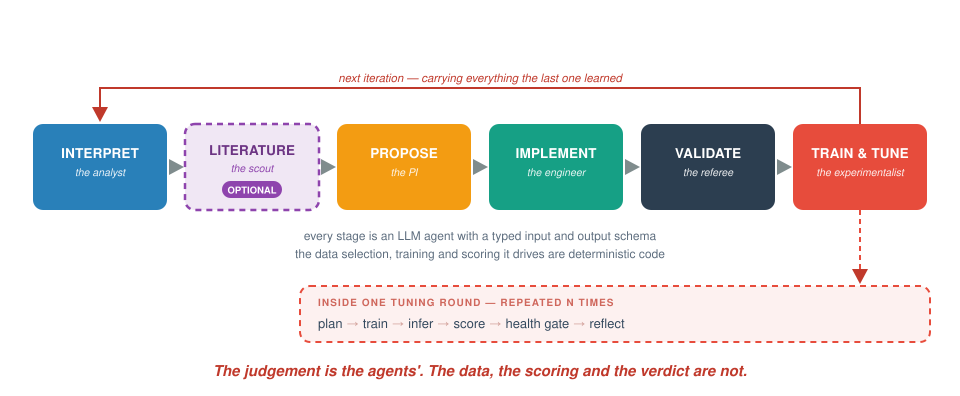
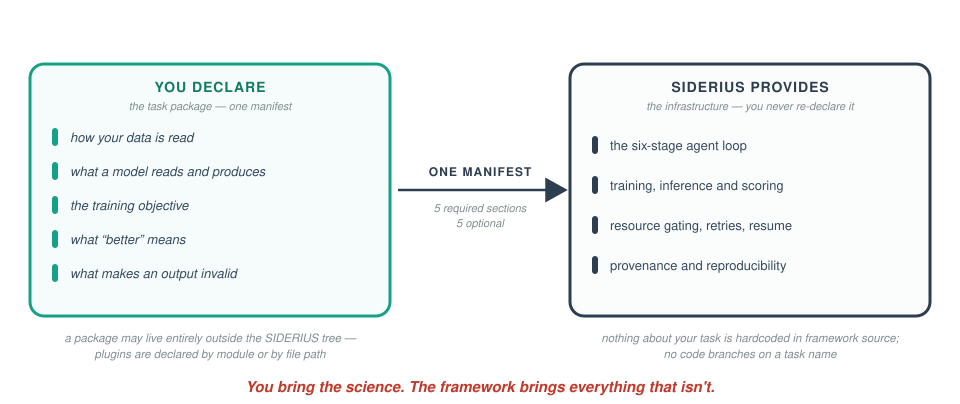
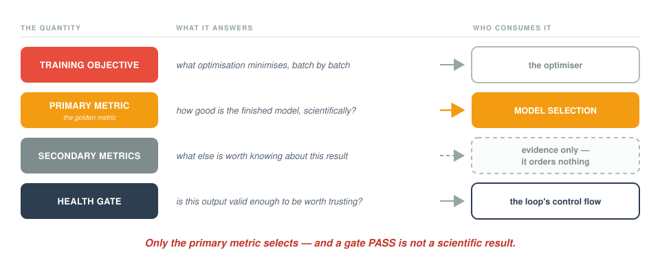

# SIDERIUS

### **S**cientific **I**nquiry, **D**esign, **E**xploration, and **R**easoning **I**ntegrated **U**sing multi-agent **S**ystems

**A closed-loop research framework for supervised scientific machine learning.**
You describe a scientific task; SIDERIUS runs the loop a research group would run
— read the evidence, propose a model, implement it, check it, train it, score it,
judge whether the result is trustworthy, interpret what happened, and go again.

> *"All truths are easy to understand once they are discovered; the point is to
> discover them."* — Galileo Galilei

---

## Why you might want it

You have a supervised scientific problem, a way to measure success, and more
architectural ideas than time to try them.

SIDERIUS automates the *research* loop, not just the search. The parts that
require judgement — reading diagnostic evidence, forming a hypothesis about why
the last attempt behaved as it did, deciding what to try next — are performed by
LLM agents. The parts that must be exact — data selection, training, scoring,
validity checking, provenance — are deterministic code, and no agent is allowed
to influence them.

It is **not** an AutoML library (it writes new model code rather than searching a
fixed space), **not** a general agent framework (the workflow is a fixed,
deterministic path), and **not** a hyperparameter sweeper (tuning is one phase
inside a larger loop).

## The loop



An optional literature-review stage runs between interpretation and proposal,
surfacing recent papers as soft priors.

## Who provides what



Nothing about your task is hardcoded in framework source. A **task package** is
one YAML manifest — ten possible sections, five required — plus whatever small
amount of Python the framework cannot supply generically for your data. A package
can live entirely outside this repository.

→ [What a task must provide](docs/concepts/task-package.md) ·
[the full section table](docs/reference/task-composition.md)

## Four numbers, and only one of them decides

This distinction is the one most worth understanding before you start:



Only the **primary metric** selects models. Additional **secondary metrics** are
observational evidence and influence no ordering anywhere — deliberately, so that
watching six quantities does not silently turn your run into a multi-objective
optimisation nobody declared.

A **health gate PASS is not a scientific success.** It means nothing detectably
invalid — a model can pass every gate and be useless. Gates exist to catch
collapse before it burns GPU-hours.

→ [Objectives and metrics](docs/concepts/objectives-and-metrics.md) ·
[Health gates](docs/concepts/health-gates.md)

## What has actually been demonstrated

SIDERIUS is contract-driven rather than modality-limited — nothing in its source
branches on a task name. Three example tasks exist as evidence of tested breadth,
**at deliberately different maturity**:

| example | shape | status |
|---|---|---|
| **TIDMAD** | 1-D scientific signal denoising (SQUID time series, axion dark-matter search) | ✅ runs the full agent loop end-to-end through the production chain |
| **Oxford-IIIT Pet** | RGB image, 37-way breed classification | 🟡 real data, training, inference and scoring — through a direct-execution harness, **not** the production chain |
| **DAVIS 2017** | RGB spatiotemporal, 8→4 future-frame prediction | 🟡 same |

The difference is real and this documentation states it everywhere it matters:
the execution path below the composition edge is not yet task-neutral end to end,
so the contrast tasks cannot currently run the chain. Closing that is in flight.

→ [Supported tasks and current maturity](docs/concepts/supported-tasks.md) —
current state and target state in one table

## Quickstart

```bash
curl -LsSf https://astral.sh/uv/install.sh | sh
git clone git@github.com:Galileo-Sandbox/SIDERIUS.git && cd SIDERIUS
uv sync && source .venv/bin/activate

cp tidmad_data_config.example.yaml tidmad_data_config.yaml   # edit paths
cp dashboard_config.example.yaml   dashboard_config.yaml
printf 'OPENAI_API_KEY=...\n' > .env

python env_validation/test_agent_env.py     # environment + API reachability
uv run pytest tests/unit/ -q                # no GPU, no API calls
```

Then see what a real run would execute, without executing it:

```bash
bash sdsc_submission_scripts/run_chain.sh --mode lilab \
    --workspace /path/to/workspace --run_name first_run_v1 \
    --task_composition configs/task_composition/tidmad.yaml \
    --data_dir /path/to/tidmad/data \
    --llm_config llm_configs/openai_tiered_pro.json \
    --num_iterations 1 --max_rounds 1 --dry-run
```

Always pass an explicit `--llm_config` (the file shown is the canonical
example) — omitting it silently selects a deprecated all-Gemini default. A
tiny synthetic quickstart example (`examples/quickstart/`) is in preparation.

→ [Installation](docs/getting-started/installation.md) ·
[Your first run](docs/getting-started/first-run.md)

## Fresh runs and resume

Two verbs, decided by the workspace you point at: a new directory is a
**fresh** run; re-running the same command against an existing workspace
**resumes** it from the first incomplete iteration (auto-resume is the
default). Changing the declared semantics — data scope, health configuration —
against an existing workspace is **refused at startup** by the invariants
lock, because aggregate scores are only comparable within one declared
identity. New settings, new workspace.

→ [Workspaces and resume](docs/guides/workspaces-and-resume.md)

## Extending SIDERIUS

The principle: **infrastructure specifies protocols; scientific semantics live in
task packages.** Adding a task should never require editing framework source.

You need only configuration when the framework already has a generic
implementation of what you need — several health checks, for instance, are
reusable by any task of the right shape. You need a plugin when your data access
or your metric mathematics is genuinely yours. Either can be declared by
importable module or by file path, and a file-declared plugin's content hash
joins the run's identity, so an edited plugin is detected rather than silently
used.

→ [Define your own task](docs/guides/define-a-task.md)

## Documentation

| you are… | start at |
|---|---|
| new here | [What SIDERIUS is](docs/concepts/overview.md) → [Quickstart](docs/getting-started/installation.md) |
| building a task | [What a task must provide](docs/concepts/task-package.md) → [Define your own task](docs/guides/define-a-task.md) |
| running experiments | [Operating a run](docs/guides/operating-a-run.md) → [Entrypoints](docs/reference/entrypoints.md) |
| looking at a workspace, or debugging one | [Workspaces and resume](docs/guides/workspaces-and-resume.md) → [Troubleshooting](docs/guides/troubleshooting.md) → [Dashboard](docs/guides/dashboard.md) |
| developing the framework | [Agent reference](docs/agent-reference/README.md) → [`CLAUDE.md`](CLAUDE.md) |

Full map: [`docs/README.md`](docs/README.md). Glossary:
[`docs/concepts/glossary.md`](docs/concepts/glossary.md).

## Repository layout

```
agent/          LLM transport (one gateway), schemas, typed protocols, atomic skills
nodes/          the six workflow nodes, one directory each, each with its .md
workflows/      deterministic graph traversals + task composition
core/           sandbox executor, hardware context, resume, run invariants
execute_tools/  training / inference / scoring subprocesses, data paths, metrics,
                health checks
ml_models/      built-in models + loss configs + plugin loader
agent_generated/  LLM-written model and loss plugins (gitignored)
configs/        task semantics and framework policy — see the configuration map
examples/       the three example task packages
sdsc_submission_scripts/  chain launchers (--mode lilab | sdsc)
scripts/        standalone runners and baselines
dashboard/      FastAPI + Plotly result browser
docs/           documentation (see the map) + design history
tests/          unit + integration tiers
```

The major modules carry their own contract READMEs —
[`workflows/`](workflows/README.md) · [`core/`](core/README.md) ·
[`execute_tools/`](execute_tools/README.md) ·
[`execute_tools/health_checks/`](execute_tools/health_checks/README.md) ·
[`ml_models/`](ml_models/README.md) ·
[`agent/schemas/`](agent/schemas/README.md) — all following one
[template](docs/agent-reference/MODULE_README_TEMPLATE.md).

## Key invariants

Before contributing, four rules that are enforced, not aspirational:

1. **Pydantic at every boundary.** LLM output → schema → execution. Execution
   reads the validated object, never a raw dict.
2. **Nodes communicate only through schemas, protocols and their own storage.**
   Storage is a log, not a channel; reading a peer's output file is a defect.
3. **One LLM gateway.** Every agent call routes through `agent/llm_bridge`;
   direct provider constructors elsewhere are CI-banned.
4. **One authority per rule.** Metric direction has exactly one interpreter;
   deliverable naming has one owner. Re-inlining any of them is the defect the
   guards exist to catch.

Full standards: [`CLAUDE.md`](CLAUDE.md).

## Testing

```bash
uv run pytest tests/unit/ -q          # CI gate: mocked LLM, no GPU
uv run pytest tests/integration/ -q   # full orchestration, predefined responses, ms
```

Real-API and real-training tiers are opt-in (`--real-api-call`,
`--real-training`, `-m real_run`) and skip automatically without the required
keys. They never run in CI.

## License

(To be added.)
