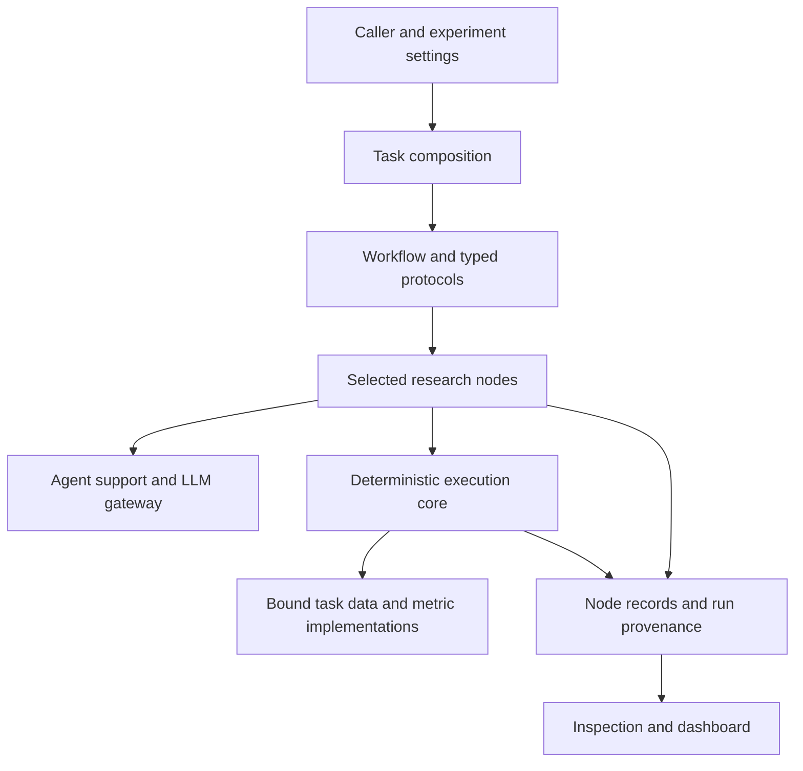

# Framework architecture

This reference describes the landed framework and routes implementation work to
its semantic owners. Scientific task packages and experiment launch settings
live outside the framework; the companion repository owns their qualification.
The [repository map](repository-map.md) describes that version boundary.

Earlier architecture prose mixed current implementation, TIDMAD-specific
examples and future proposals. Read that preserved version from this checkout
with `git show 69d20786e4f36f3426c240c598e99c8c0abb1bb5:docs/architecture.md`.
Treat it as historical context, not an additional current contract. The
[design index](design/README.md) owns other historical proposals.

## Ownership boundaries

| Layer | Owns | Current entry |
| --- | --- | --- |
| Scientific task | Data meaning, task scopes, model I/O, objective, metrics, Health and task-local code | [Task composition](reference/task-composition.md) |
| Caller and workflow | Which capabilities run, their typed inputs, carried history and experiment settings | [Workflow package](../src/workflows/README.md) |
| Research node | One bounded research capability and its output records | [Node directory](../src/nodes/README.md) |
| Agent support | Prompt rendering, tool-backed reasoning, schemas and LLM transport | [Agent package](../src/agent/README.md) |
| Execution core | Subprocess execution, resource control, workspace state and provenance | [Core package](../src/core/README.md) |
| Task execution seams | Dataset materialization, training, deliverable codecs and declared metric execution | [Execution package](../src/execute_tools/README.md) |
| Observation | Read-only result inspection and dashboard projection | [Dashboard](../src/dashboard/README.md) |

The task supplies scientific meaning through validated declarations and plugins.
The framework does not choose a task from a directory name or assign a universal
input/output tensor shape. A workflow may impose an explicit experiment policy,
such as parameter rules or training budgets, without redefining the task metric.

## Research capabilities and typed edges

The node package exposes interpretation, Data Analysis, Literature Review,
model proposal, implementation, code validation and hyperparameter tuning.
The [node index](agent-reference/index.md#nodes) links each public class and
contract. Data Analysis has an independent typed Python API; the CLI map names
only nodes that actually expose a CLI. No default file index applies to all nodes.

A node accepts its input schema and returns its output schema. A protocol
function maps available upstream outputs into a downstream input. These are
in-process typed boundaries, not a requirement that each node be a pure function:
nodes can call providers, execute tools and persist their own records. Storage
is evidence and recovery state, not a hidden channel for reading another node's
output by filename convention.

The reference fixed workflow is implemented in
[model_exploration.py](../src/workflows/model_exploration.py). It determines
sequence and iteration state. The optional scientific-evidence stage selects
Data Analysis/Literature Review traversal from declared configuration. Nodes do
not decide the whole graph or call peer nodes to invent additional workflow edges.
For a different traversal, use the
[custom workflow contract](guides/custom-workflow.md).

This is an ownership diagram, not a fixed promise that every stage executes.
Cold starts, disabled stages, validation refusals and budget decisions change
the actual traversal recorded for a run.

## Task composition and model contracts

[task_composition.py](../src/workflows/task_composition.py) resolves an explicit
manifest, validates declared sections, loads content-identified implementations
and establishes run-scoped bindings. The
[composition mechanism](agent-reference/mechanisms/composition.md) owns absence
semantics and binding lifetime; the
[manifest reference](reference/task-composition.md) owns the section inventory.
Do not infer required fields or capabilities from an old example manifest.

The task config carries scientific description and a forward contract. The
resolved typed model-I/O contract supplies input/output shape, dtype and output
semantics to validation and probe consumers. Classification and regression
have different valid contracts; `[B,T]` to `[B,256,T]` is a historical task
example, not a framework-wide requirement. The
[model package contract](../src/ml_models/model-contract.md) owns model/loss
registration and description lookup.

Training objectives and evaluation metrics are separate authorities. The
objective controls optimization; the primary metric controls scientific
ordering through `MetricOrder`. Secondary metrics are observational evidence.
Scoreability is checked before the ordinary evaluation metric's arithmetic;
candidate-evaluator delegation has a separate executable contract. See
[metric mechanisms](agent-reference/mechanisms/metrics.md).

## Data, scopes and process transport

A bound `TaskDataPath` materializes training and evaluation datasets and owns
its deliverable read/write codecs. Optional sibling capabilities cover scope
construction, trial anchoring, Health coverage and other declared needs. The
[protocol owner](../src/execute_tools/task_data_path.py) and
[data-path reference](agent-reference/mechanisms/data-path-and-scope.md) define
those capabilities; geometric resemblance to TIDMAD does not select them.

Task-owned scopes remain opaque to generic execution. The task serializes them;
the framework transports artifact paths and digests, verifies bytes in children,
then delegates deserialization. Integrity of transport is separate from proof
of scientific train/test independence. Task qualification must establish the
latter with the [split-evidence contract](guides/define-a-task.md#required-task-owned-split-evidence).

Legacy partition SampleSets use a separate membership-validation path. The
standard workflow refuses a partial file-index `--data_scope` when the composed
profile does not declare the compatible topology. That check inspects the
profile capability, not a task-name string. The caller supplies the physical
data root explicitly; generic modules do not discover a scientific dataset from
an environment variable or a task-specific framework configuration file.

## Execution, resources and Health

The sandbox executor launches training, inference and scoring children using
the selected environment and explicitly transported task inputs. Run-scoped
bindings in the parent are not assumed to exist in a fresh child. Plugin-root
transport, scope verification and manifest re-composition preserve the selected
execution authority. See the
[execution mechanism](agent-reference/mechanisms/execution.md).

Process separation and runtime controls are not an OS security boundary for
malicious generated code. Role ceilings constrain process address space;
watchdog-owned launches have deadline/process-group controls. Neither mechanism
promises immunity to every host or GPU failure. Resource admission, runtime
measurement, cooperative budgets and watchdog selection have distinct owners
under [runtime control](../src/core/runtime_control/README.md).

The tuner reaches the shared Health boundary after successful scoring.
Disabled Health, position selection and applicability affect which checks run;
a scoring failure returns before that Health evaluation. A valid metric value,
a passed scientific check and an eligible candidate are separate facts. Follow
[Health semantics](agent-reference/mechanisms/health-gates.md) and the task's
own evidence before making a scientific-validity claim.

## Persistence, resume and observation

A workspace owns generated code, node records, configurations and run artifacts.
The framework records composition/plugin identities and launch invariants so a
resume can compare the authorities required by its contract. Some recorded
fields are provenance rather than resume-equality requirements; the
[workspace/resume reference](guides/workspaces-and-resume.md) and
[run-invariants source](../src/core/run_invariants.py) define the distinction.

Generated model/loss libraries are workspace-bound through supported entrypoints.
Installed code and package resources are read separately from mutable run state.
A wheel does not provide a checkout's launch scripts or external scientific
assets. See [installation](getting-started/installation.md) and the
[source package map](../src/README.md).

The dashboard reads stored evidence and projects it for inspection. It does not
own training, metric direction, candidate eligibility or scientific validation.
The local backend is implemented; a PostgreSQL declaration is not evidence of a
working backend. Configuration and backend limits live in the
[dashboard contract](../src/dashboard/dashboard-contract.md).

## Verification and change routing

Use source and focused tests as capability evidence. A design document, package
presence or passing synthetic example does not qualify a new external task or
source pair. The [supported-task reference](concepts/supported-tasks.md) routes
existing evidence; the [gate index](gates/README.md) separates validation scopes.

For implementation work, begin with the owning package or node contract above,
then its schemas and tests. Update that owner when behavior changes. Keep
cross-cutting rules in [CLAUDE.md](../CLAUDE.md), not duplicated in architecture
prose. This page provides the system map; it does not create another rule set.
